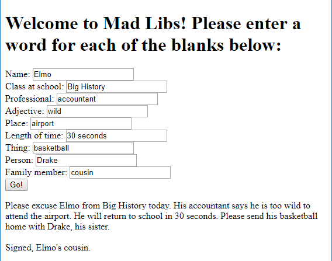

# madLibs

A Mad Lib is a word game. The game prompts players to give random parts of speech or types of items (e.g. noun, adjective, animal, food, colour, etc.), then uses the player's words to fill in the blanks of a story. The results usually range from silly to absurd. The story remains a secret until the words have been selected, so the player can't be influenced.

Your job is to create a Mad Lib game. Create your own story or find one to use.

#### Example:

## Steps

1. Open Brackets. In your GH folder, **pull from upstream** to get the latest changes, then create a new file.

  - Save the new file as `madLibs.html` in *this directory* (`GH/4_programming/modules/madLibs/`).
  - Fill out the basic structure of the HTML from memory, or use a template or past project.

2. **HTML:** Add a title, instructions, a set of `<input>` elements with captions, and a button.

3. **JavaScript:** Create a function that will execute when your button is clicked.

  - Your function should retrieve the value of each `<input>` element and join them together into your pre-programmed story.
  - When your function finishes, it should show the story, either by placing it into the HTML or displaying an alert.

4. Use the resources below to guide you through the process.

## Resources

| Requirement | Resource |
|-------------|----------|
| Input elements | <ul><li>[Different input types (W3Schools)](https://www.w3schools.com/tags/att_input_type.asp)</li></ul> |
| Buttons     | <ul><li>[HTML button element](https://www.w3schools.com/tags/tag_button.asp)</li><li>[Button onclick event (linking to functions)](https://www.w3schools.com/jsref/event_onclick.asp)</li></ul> |
| Getting HTML content | <ul><li>[getElementById() (W3Schools)](https://www.w3schools.com/jsref/met_document_getelementbyid.asp)</li><li>[Input text value property (W3Schools)](https://www.w3schools.com/jsref/prop_text_value.asp)</li><li>[Getting dropdown selection value (W3Schools)](https://www.w3schools.com/jsref/prop_select_value.asp)</li></ul> |
| String manipulation  | <ul><li>[JS Operators (scroll to "string operators")](https://www.w3schools.com/js/js_operators.asp)</li><li>[String concatenation (or simply use `str1 + str2`)](https://www.w3schools.com/jsref/jsref_concat_string.asp)</li><li>[JS string methods (W3Schools)](https://www.w3schools.com/js/js_string_methods.asp)</li></ul> |
| Displaying results   | <ul><li>[JavaScript output summary (W3Schools)](https://www.w3schools.com/js/js_output.asp)</li><li>Option 1: [JS alert box](https://www.w3schools.com/js/js_popup.asp)</li><li>Option 2: [Changing HTML content](https://www.w3schools.com/js/js_htmldom_html.asp)</li><li>Option 3: [console.log](https://www.w3schools.com/jsref/met_console_log.asp)</li></ul> |

| Extension            | Resource |
|----------------------|----------|
| Template literals    | <ul><li>[Template literals (advanced strings - not supported in IE)](https://developer.mozilla.org/en-US/docs/Web/JavaScript/Reference/Template_literals)</li></ul> |
| Arrays               | <ul><li>[JavaScript arrays](https://www.w3schools.com/js/js_arrays.asp) (look at "Creating" and "Access the Elements")</li></ul> |
| For loops            | <ul><li>[JS for loop (W3Schools)](https://www.w3schools.com/js/js_loop_for.asp)</li><li>[Looping through each character in a string (StackOverflow)](https://stackoverflow.com/a/1967132/4080966)</li></ul> |

## Extension

- Use [template literals](https://developer.mozilla.org/en-US/docs/Web/JavaScript/Reference/Template_literals) to simplify creating your story (note, these don't work in Internet Explorer!).
- Use an array and a for loop to retrieve the values of all of the input fields.
- Create multiple stories with different names and required words. Let the user choose by title which game they'd like to play.
- Do something else creative!

## Assessment

| Level  | Expectations |
|--------|--------------|
| Bronze | Successfully retrieves the user's inputs and displays the resulting story. |
| Silver | Uses arrays and/or template literals to optimise the code. |
| Gold   | More than one story! |

- **Note:** all code should be commented and you should have no redundant code.

Remember to commit each time you've made a major change to your code, and to push to GitHub frequently.
